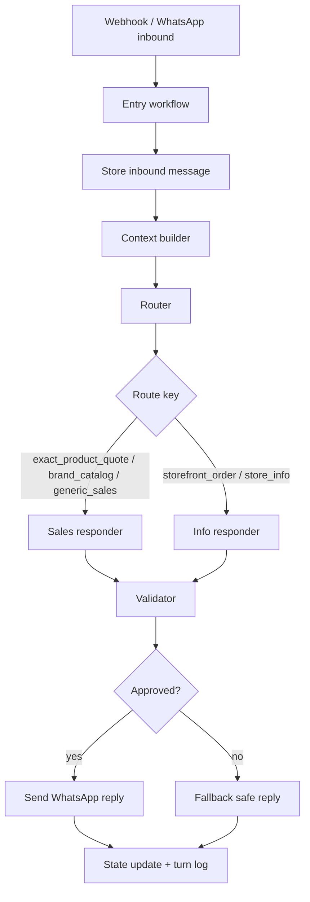

# TechnoStore V17 Architecture

## Executive Summary

`v17` replaces the current monolithic sales workflow with a typed, modular system that separates deterministic business logic from model-generated language. The target shape is one parent workflow and a small set of sub-workflows with strict JSON contracts, deterministic Supabase RPCs for retrieval and validation, and a turn log that makes every decision auditable.

This is not an "agent swarm". It is a controlled routing architecture:

- one parent orchestration workflow
- focused specialist responders by route
- deterministic retrieval and validation in Supabase
- schema-first model outputs
- explicit observability for latency, cost, failures, and route quality

The result is cheaper to operate, easier to debug, and credible in a technical review.

## Why V15 Must Be Replaced

`v15` currently collapses these responsibilities into a single graph:

- ingress normalization
- conversation aggregation
- context assembly
- intent routing
- product selection
- response generation
- metadata generation
- regex parsing and cleanup
- CRM updates
- storefront handoff logic

That shape creates four structural problems:

1. The model is asked to do business-state work and natural-language work in the same step.
2. Output control relies on free-text conventions like `---METADATA---` and special tokens in the reply body.
3. Product resolution, pricing, and link behavior are partially model-owned and partially post-processed.
4. The workflow is too large to reason about safely or share with another engineering leader.

`v17` removes all of those patterns.

## Design Principles

1. Deterministic systems own facts. The model does not invent products, prices, URLs, or order status.
2. Models generate typed decisions and reply drafts, not hidden state encoded in prose.
3. A route-specific responder should only see the minimum context needed for its job.
4. Every turn should be replayable from stored context, router output, responder output, and validator output.
5. Operational debugging must be possible without opening giant code nodes or reading prompt spaghetti.

## Target Workflow Topology

### Parent Workflow

`TechnoStore_v17_entry`

Responsibilities:

- receive webhook payload
- normalize inbound message
- dedupe and debounce
- store inbound conversation row
- build compact turn context
- route the turn
- dispatch to one responder
- validate and sanitize response
- send WhatsApp reply
- persist state delta and observability row

### Child Workflows

| Workflow | Responsibility | Input | Output |
| --- | --- | --- | --- |
| `TechnoStore_v17_context_builder` | Assemble compact turn context from Supabase RPCs | manychat id, user message, optional storefront handoff ids | `ConversationContext` |
| `TechnoStore_v17_router` | Pick one route key from the supported route catalog | `ConversationContext` | `RouterOutput` |
| `TechnoStore_v17_sales_responder` | Handle `exact_product_quote`, `brand_catalog`, `generic_sales` | `ConversationContext`, `RouterOutput` | `ResponderOutput` |
| `TechnoStore_v17_info_responder` | Handle `store_info` and `storefront_order` | `ConversationContext`, `RouterOutput` | `ResponderOutput` |
| `TechnoStore_v17_validator` | Enforce business rules and sanitize reply payloads | `ConversationContext`, `RouterOutput`, `ResponderOutput` | `ValidatorOutput` |
| `TechnoStore_v17_state_update` | Persist CRM changes, conversation metadata, and turn logs | `ConversationContext`, `ValidatorOutput` | persisted state |

For the first cut, `sales_responder` owns the sales routes, while `info_responder` owns store info and storefront follow-up.

## End-to-End Flow

## Stable Route Catalog

`v17` should use a fixed route set:

- `storefront_order`
- `exact_product_quote`
- `brand_catalog`
- `generic_sales`
- `store_info`

These route keys should be treated as part of the public internal contract. Add new routes deliberately. Do not let prompts invent them.

The router should also output a stable `search_mode`:

- `exact`
- `tier_browse`
- `brand_browse`
- `storefront_handoff`
- `info`

That allows the system to support both strict exact-model requests and broader "show me Pro / Pro Max options" behavior without weakening exact-match retrieval.

## Contract-First Model Layer

The model interface becomes schema-first. The contract files live in:

- [docs/technostore-v17/context.schema.json](/Users/aldegol/Documents/Documents%20-%20Francisco%E2%80%99s%20MacBook%20Pro/Apps/techno-store/docs/technostore-v17/context.schema.json)
- [docs/technostore-v17/router-output.schema.json](/Users/aldegol/Documents/Documents%20-%20Francisco%E2%80%99s%20MacBook%20Pro/Apps/techno-store/docs/technostore-v17/router-output.schema.json)
- [docs/technostore-v17/responder-output.schema.json](/Users/aldegol/Documents/Documents%20-%20Francisco%E2%80%99s%20MacBook%20Pro/Apps/techno-store/docs/technostore-v17/responder-output.schema.json)
- [docs/technostore-v17/validator-output.schema.json](/Users/aldegol/Documents/Documents%20-%20Francisco%E2%80%99s%20MacBook%20Pro/Apps/techno-store/docs/technostore-v17/validator-output.schema.json)
- [docs/technostore-v17/state-delta.schema.json](/Users/aldegol/Documents/Documents%20-%20Francisco%E2%80%99s%20MacBook%20Pro/Apps/techno-store/docs/technostore-v17/state-delta.schema.json)

### Explicitly Removed From V17

- `---METADATA---` blocks
- parsing business state from natural-language paragraphs
- `[HUMAN]` and `[SILENT]` markers inside message text
- regex-based product extraction from a freeform model response
- model-authored URLs
- model-authored price math
- duplicated product selection logic in both prompt and post-processor

The first-reply website policy is also explicit:

- broad first-contact routes may mention `puntotechno.com` naturally
- exact-model routes answer the model first and keep the site secondary
- the validator may append the store URL only on approved broad/info routes

## Deterministic Ownership Boundaries

### Supabase Owns

- product search and candidate ranking
- storefront handoff validation
- compact context assembly
- turn logging and reporting
- hard validation of selected product keys
- state persistence

### The Model Owns

- concise response wording
- limited structured state proposal

### The Validator Owns

- ensuring selected products exist
- ensuring reply facts match catalog data
- ensuring route-to-action consistency
- blocking invalid link or image attachment
- converting invalid model output into a safe fallback

## Supabase Foundation

`v17` adds a dedicated SQL foundation script:

- [supabase/v17_workflow_foundation.sql](/Users/aldegol/Documents/Documents%20-%20Francisco%E2%80%99s%20MacBook%20Pro/Apps/techno-store/supabase/v17_workflow_foundation.sql)

It introduces:

- `public.v17_normalize_text`
- `public.v17_brand_key`
- `public.v17_extract_brand_keys`
- `public.v17_extract_storage_values`
- `public.v17_product_search`
- `public.v17_find_candidate_products(...)`
- `public.v17_validate_storefront_handoff(...)`
- `public.v17_build_turn_context(...)`
- `public.ai_workflow_turns`
- `public.v_ai_workflow_turn_daily`

The intent is straightforward:

- use existing views like `v_product_catalog`, `v_customer_context`, `v_recent_conversations`, and `v_store_context`
- add deterministic search and context assembly on top
- stop rebuilding context inside giant n8n code nodes

## Sub-Agent Strategy

The correct "subagent" pattern here is specialization, not autonomy.

Good:

- router stage
- route-specific responders
- validator or evaluator stage

Bad:

- recursive agent orchestration inside n8n
- one worker per customer message
- dynamic tool planning for simple sales questions

This system should behave like a production service pipeline, not like an autonomous research assistant.

## Debugging and Observability

Every turn should persist:

- workflow version
- provider name and model name
- route key
- raw compact context
- router output
- responder output
- validator output
- final state delta
- selected product keys
- validation errors
- token counts
- estimated cost
- latency
- success or failure reason

That data lives in `public.ai_workflow_turns` and rolls up into `public.v_ai_workflow_turn_daily`.

This makes it possible to answer questions like:

- Which routes are failing?
- Which model costs are growing fastest?
- Which products get hallucinated most often?
- Which responder has the highest fallback rate?

## Cost Controls

`v17` is designed to reduce cost in the places that matter:

- the router sees compact context, not the full catalog dump
- responders see only route-relevant context
- deterministic search reduces prompt size
- one validator can be rules-first before any second-pass model call
- the system stores enough telemetry to identify expensive failure modes

If you later add model routing by value, use this rule:

- low-risk catalog and store-info routes stay on the cheaper model
- ambiguous or high-value closing routes can escalate to a stronger model

Do not start with cross-model routing until the contracts and telemetry are stable.

## Implementation Order

1. Create the Supabase foundation and confirm RPC outputs.
2. Build `TechnoStore_v17_context_builder` around `v17_build_turn_context`.
3. Build `TechnoStore_v17_router` with strict JSON output.
4. Build the three responder workflows.
5. Build `TechnoStore_v17_validator` with deterministic checks first.
6. Build `TechnoStore_v17_state_update` and wire the turn log.
7. Replay historical chats against `v17` before production cutover.

## Rollout Plan

### Phase 1

- route and respond with strict JSON
- keep fallback behavior conservative
- log every turn

### Phase 2

- enable deterministic product ranking from Supabase
- tighten validator rules
- compare route accuracy and cost against `v15`

### Phase 3

- ship controlled production traffic
- monitor fallback rates, wrong-product rate, and cost per resolved conversation

## Definition Of Done

`v17` is only ready when:

- no business state is parsed from prose
- no product key is accepted without validation
- no pricing or link attachment is model-owned
- every route has a stable schema
- every turn is logged and replayable
- the workflow graph is understandable without opening giant code nodes

That is the threshold for a serious architecture review.
